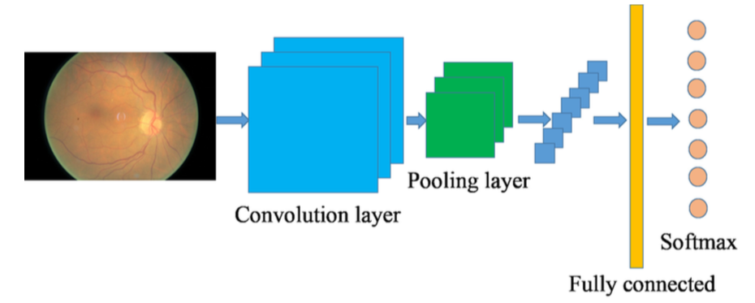
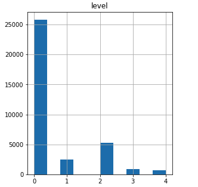
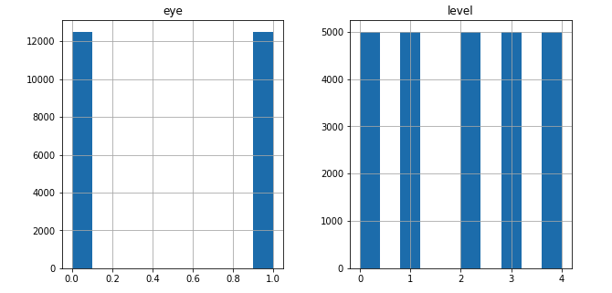
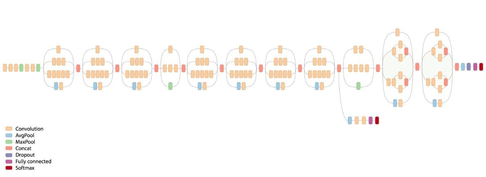
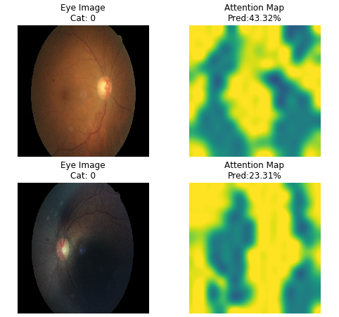
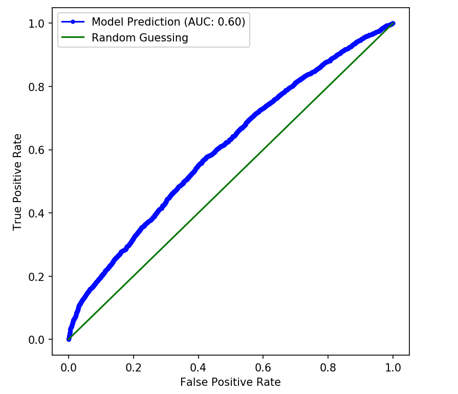
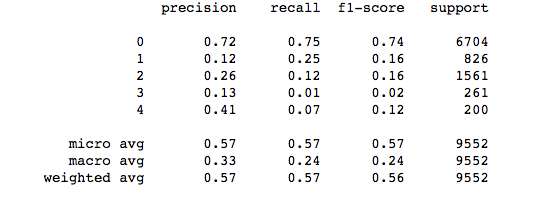
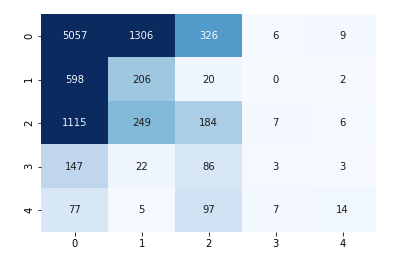

# Introduction 

During the summer of 2018 and the following school year, I had the opportunity to work in the **National Institute of Health (NIH)** Lister Hill Center to study convolutional neural network for early detection of diabetic retinopathy eye disease.  The project was conducted under the mentorship of Dr. Jongwoo Kim.

## DR (Diabetic retinopathy)

[Diabetic retinopathy](http://en.wikipedia.org/wiki/Diabetic_retinopathy) is the leading cause of blindness in the working-age population of the developed world. It is estimated to affect over 93 million people.

Around 45% of Americans with diabetes have some stages of the disease. Progression to vision impairment can be slowed or averted if DR is detected in time, however this can be difficult as the disease often shows few symptoms until it is too late to provide effective treatment.

Presently, detecting DR is a manual time-consuming process that requires a trained clinician to examine and evaluate digital fundus photographs of the retina. By the time human readers submit their reviews, sometimes several days later, the delayed results lead to lost miscommunication, follow up, and delayed treatment.

## Computer Vision through Convolutional Neural Network

Convolutional Neural Networks (CNNs), a branch of deep learning, have a great record for applications in image analysis and interpretation, including medical imaging. However, it wasn’t until several breakthroughs in neural networks such as the implementation of dropout, rectified linear units and the accompanying increase in computing power through graphical processor units (GPUs) that CNNs became viable for more complex image recognition problems. Presently, large CNNs are used to successfully tackle highly complex computer vision tasks with many object classes to an impressive standard. CNNs are used in many current state-of-the-art image classification tasks such as the annual ImageNet challenges.

## CNN for Diabetic Retinopathy detection

[Convolutional Neural Network](https://en.wikipedia.org/wiki/Convolutional_neural_network) is a feed-forward neural network.  It mainly consists of an input layer, many hidden layers (such as convolutional relu, pooling, flatten, fully connected and softmax layers) and a final multi-label classification layer. CNN methodology involves two stages of processing, a time consuming training stage where millions of images went through CNN architecture through many iterations to finalize the model parameters of each layer and a second real-time prediction stage where each image in test dataset is feeded into the trained model to score and validate the model.

The output of the above framework will emit a multi-class prediction with confidence score on each category
* 65% No DR (Normal)
* 15% Category-2 DR
* 10% Category-4 DR

However, there are two issues with CNN methods on DR detection. One is achieving a desirable offset in sensitivity (patients correctly identified as having DR) and specificity (patients correctly identified as not having DR). This is significantly harder for a five class problem of normal, mild DR, moderate DR, severe DR, and proliferative DR classes. Second problem is the overfitting situation.  Skewed datasets cause the network to over-fit to the class most prominent in the dataset. Large datasets are often massively skewed.

# Our Work

We explored the use of deep convolutional neural network methodology for the automatic classification of diabetic retinopathy using color fundus image.  We evaluated several CNN architectures and studied various tuning techniques in model training.

## Methodology

In this project, we evaluated several CNN architecture (Inception Network, VGG16) on their performance in DR image recognition.  We applied various standard techniques to cleanse and augment the data, we also optimized the CNN network to accomodate the skewed data sets.

Our experiment was conducted on the hosted Linux platform with NVidia Tesla K80 GPU.  The environment was hosted by Google Colab and Kaggle.

### Datasets
#### Kaggle DR competition dataset

Our main dataset is based on the [Kaggle Diatebic Retinopathy Detection competition] (https://www.kaggle.com/c/diabetic-retinopathy-detection) which was carried out in 2016.  The main dataset contains 35000 eye images with 5 stages of DR disease.

#### Messidor dataset

We also augmented the dataset with [Messidor dataset](http://www.adcis.net/en/Download-Third-Party/Messidor.html) which contains 1200 images with 4 stage DR progression.  Although the Messidor dataset is smaller, it has less labeling errors.

### Stages of diabetic retinopathy (DR) with increasing severity
The following figures show the 5 class DR classification in our study, ranging from DR_0 (No DR) to DR_5 (Proliferative DR).

#### Unbalanced training data set

Skewed datasets cause the network to over-fit to the class most prominent in the dataset. Large datasets are often massively skewed. 

In the Kaggle dataset with 35000 images, we used less than three percent of images came from the 4th and 5th class.  This means changes had to be made in our network to ensure it could still learn the features of these images.  To overcome the difference in data points distribution, we used the the sampling with [replacement statistics technique](https://web.ma.utexas.edu/users/parker/sampling/repl.htm) to boost up the data samples in category 2, 4 and 5:

For the eye distribution between left and right eye, we have a balanced distribution after replacing techniques.

### CNN Architectures

There are various CNN architecutres proposed in the academia: VGG16, Inception, ResNet, GoogLeNet.  [This pyImageSearch article](https://www.pyimagesearch.com/2017/03/20/imagenet-vggnet-resnet-inception-xception-keras/) has a good introduction to many poppular CNN architectures.  In our study, we evaulated the performance of InceptionV3 vs. VGG16

#### InceptionV3

The Inception microarchiveture was first introduced by Szegedy et al. in their 2014 pagper [Going Deeper with Convolutions](https://arxiv.org/abs/1409.4842).  The goal of the inception module is to act as "multi-level feature extractor" by computing 1x1, 3x3 and 5x5 convolutions within the same module of the network.  The original incarnation of this architecture was called GoogLeNet, but subsequent manifestations have simply been called Inception vN where N is the version number put out by Google.

Our implementation of InceptionV3 was mostly inspired from the work by [Kevin Mader](https://www.kaggle.com/kmader/inceptionv3-for-retinopathy-gpu-hr/notebook)

#### VGG16 and VGG19

The VGG network architecture was introduced by Simonyan and Zissermain in their 2014 paper: [Very Deep Convolutional Networks for Large Scale Image Recognition](https://arxiv.org/abs/1409.1556). VGG network is characterized by its simplicity, using only 3x3 convolutional layers stacked on top of each other in increasing depth.  Reducing volumn size is handled by max pooling.  Two fully-connected layers, each with 4096 nodes are then followed by a softmax classifier (above).  The "16" and "19" stands for the number of weight layers in the network.

#### Comparison between InceptionV3 and VGG16

On the high level the difference between the two networks are:
1. The weights for Inception V3 are smaller than both VGG and ResNet coming in at size of 96MB.
2. One drawback for VGGNetwork are one it is slow to train and the network architecture weights themselves are quite large large.

|Network|Accuracy|
|-------|--------|
|InceptionV3|60%|
|VGG16|To be filled|

### Optimizing CNN
#### Data Augmentation
Researchers usually use some image transformation techniques to boost up the quality of the images.  Five different transformation types are used here, including flipping, rotation, rescaling, shearing and translation. See the following table for details:

|Transformation|Description|
|--------------|-----------|
|Rotation|0-360|
|Flipping|0 (without flipping) or 1 (with flipping|
|Shearing|Randomly with angle between -15 and 15|
|Rescaling|Randomly with scaling factor between 1/1.6 and 1.6|
|Translation|Randomly with shift between -10 and 10 pixels|

### Study on different image sizes

The image size from Kaggle competition dataset is 3072x2048 but this image size would be too big for most the training platforms.  Researchers usually scale down the image size before training. Various neural networks usually prefer different image input size: VGG prefers 224x224 while InceptionV3 prefers 299x299.

We tried various image size for the training with the result below.  From our experiment, the 512x512 image size still gives up the best result.

|Image Size|Accuracy|
|----------|--------|
|224x224|53%|
|299x299|59%|
|512x512|62%|

### Study on different image preprocessing techniques

As described above, there are various image preprocessing techniques we can apply before the training. The following tables shows the experiment result with and without those preprocessings:

|Transformation|Accuracy|
|--------------|-----------|
|90 degree Rotation|60%|
|Horizontal Flipping|63%|
|Vertical Flipping|72%|
|Shearing, Cropping|59%|

### Study on different sampling techniques and different data sample size

Because of the skewed data distribution among 5 DR categories, we only have a few hunderd data samples in category 4 and category 5.  One technique to compensate for low data volume in those categories is to replace and reuse the sample data.  We used this technique and we also show the impact on different data sampling on the final outcome:

|Sampleing Technique|Accuracy|
|--------------|-----------|
|Reuse Data Sample|60%|
|No data reuse|35%|

|Data sample size|Accuracy|
|--------------|-----------|
|750|62%|
|1500|TBD|
|10000|TBD|
|20000|TBD|
|35000|60%|

The table above shows the result for different sampling size, the variance on the result is not significant.  It has more to do with the randomness in the sampling and data distribution among DR categories.

### Training with pretrained model

Building and training a deep neural network (e.g. VGG19) from sratch takes a lot of time.  [Transferred learning](https://en.wikipedia.org/wiki/Transfer_learning) is a technqueue to transfer a model parameter pretrained in a common public dataset (e.g. ImageNet) to the new image domains.  Since the final categories are different between ImageNet (categorize for common objects) and DR (categorize for eye disease).  We usually use the notop pretrained model, meaning we will retrain the final classification layer.

Here are our result on training time and accuracy achieved between pre-trained model and train-from-scratch:

|Training Method|Accuracy|Training Time|
|---------------|--------|-------------|
|VGG Pretrained|35%|TBD|
|VGG From scratch|TBD|TBD|
|Inception Pretrained|TBD|TBD|
|Inception From scratch|TBD|TBD|

In most of our study in this project, we are using pretrained model.

### Optimization, Attention Map

[Attention Map](http://akosiorek.github.io/ml/2017/10/14/visual-attention.html) is a mechnism to expand the capabilities of neural network, they enable focusing on specific parts of the input.  It has been shown they can improve the performance results of neural processing.  We have shown here some eye pictures and the attention maps exerted on the region to help processing.

## Prelimary Results

We are still in the middle of carrying out various tuning and comparison study as described above.  Here we show some prelimary results of training using 35000 images: 

### Model Prediction with AUC scores:

AUC is an abbrevation for area under the curve.  It is used in classification analysis to determine which of the model predicts the classes best.

### Precision per category and heatmap

As we described earlier, the precision/recall on each of the DR category are different.  The top (category 0) and bottom (category 4) has higher precision scores.

And similarly we show the heatmap on the right.  As expected, most of the data points are concentrated on the top left corner for category 0. Note that in the heatmap, each row represents a actual lable, each column represents a predicted label.

## Future Work

Our work in DR classification with CNN neural network is still very primitive.  Given more time and resources, we would like to extend the study to cover:

1. Comparison study on more neural network architectures such as GoogleNet, ResNet
2. Training on high graded datasets with high fidelity images 
3. Training on more balanced datasets on each subcategory of DR.
4. Better data sampling techniques, reusing data sample with replace=True in sampling might cause data leakage;
5. Better target varialbe (e.g. age) normalization
6. Tune with attention related techniques to focus on areas

# Related Work

There are extensive research being carried out on methods of DR with encouraging results especially in the area of binary classification. 

In [1], Gulshan et al. from Google Labs have trained a custom neural network using 128000 expert graded images.  They achieved sensitivity of 97% on EysPACS-1 dataset.  It doesn't give a breakdown result of each sub-category of DR.  Based on the authors' discussions, the results are benefited from large training dataset, the training images are graded multiple times by experts, but the results are still limited to a specific DR not for the combination of DR and other eye diseaess.  In [2], Pratt et al. have trained a custom neural network with about a dozen layers.  The training dataset was based on 35000 Kaggle competition data sets, they were using preprocessing techniques such as color normalization and agumentation.  They achived accuracy of about 75% overall with the accuracy on middle classes around 50%. In [3], Lam et. al in Standford group has trained the neural network model based on GoogleNet and AlexNet.  They have used two datasets with images coming from Kaggle and Messidor-1 datasets.  They have tuned the network performance using techniques such as batch normalization, L2 regularization, gradient descent update rules.  They were able to achieve accuracy of 85% and 75% on no DR and severe DR cases respectively but only 29% on mild DR.  They also compared the network performance on a pretrained network with the pretrained model achieves 74% accuracy. 

Prior to the rise of neural network, most of the research on DR classification was based on traditional machine learning methods such as support vector machine, random forest and XGBoost.  The work usually involved heavy feature extraction and hence can only be done on a small dataset.  In [10], Xu et al compared the implementations with XGBoost (accuracy 89%) and CNN (accuracy 95%), the training was based on MxNet. In [11], Jaafar et al. based their study on a hand-made top-down image segmentation and feature extraction tool to extract features such as blood vessels, foves, exudates and optic discs.  The achieved accuracy of 93% on a very small 147 images dataset. In [4] Ramon et al. based their study on a traditional random forest learning model on a small 100 image dataset with about 90% accuracy.  They also compared their result with the traditional logistic regression with is about 70% accuracy.

# References

1. Varun Gulshan, Lily Peng, Marc Coram. "Development and Validation of a Deep Learning Algorithm for Detection of Diabetic Retinopathy in Retinal Fundus Photographs" JAMA Network, Decemeber 1, 2016. https://static.googleusercontent.com/media/research.google.com/en//pubs/archive/45732.pdf
2. Harry Pratt, Frans Coenen, Deborah Broadbent, Simon Harding, Yalin Zheng. "Convolutional Neural Networks for Diabetic Retinopathy" 20th Conference on Medical Image Understanding and Analysis (MIUA 2016) July 25, 2016. https://www.sciencedirect.com/science/article/pii/S1877050916311929
3. Carson Lam, Darvin Yi, Margaret Guo, Tony Lindsey.  "Automated Detection of Diabetic Retinopathy using Deep Learning" Proceedings - AMIA Joint Summits on Translational Science.  May 18, 2018. https://www.ncbi.nlm.nih.gov/pmc/articles/PMC5961805/
4. Casanova, Ramon, Santiago Saldana, Emily Y. Chew, Ronald P. Danis, Craig M. Greven, and Walter T. Ambrosius. "Application of Random Forests Methods to Diabetic Retinopathy Classification Analyses." PLOS ONE 9, no. 6 (2014): 1-7. Accessed December 26, 2014. www.plosone.org.
5. Sinthanayothin, C., J.F. Boyce, T.H. Williamson, H.L. Cook, E. Mensah, S. Lal, and D. Usher. "Automated Detection of Diabetic Retinopathy on Digital Fundus Images." Diabetic Medicine 19 (2002): 105-12.
6. Usher, D., M. Dumskyjs, M. Himaga, T.H. Williamson, S. Nussey, and J. Boyce. "Automated Detection of Diabetic Retinopathy in Digital Retinal Images: A Tool for Diabetic Retinopathy Screening." Diabetic Medicine 21 (2003): 84-90.
7. Jaafar, Hussain F., Asoke K. Nandi, and Waleed Al-Nuaimy. "Automated Detection And Grading Of Hard Exudates From Retinal Fundus Images." 19th European Signal Processing Conference (EUSIPCO 2011), 2011, 66-70.
8. "National Diabetes Statistics Report, 2014." Centers for Disease Control and Prevention. January 1, 2014. Accessed December 26, 2014.
9. "Diabetes." World Health Organization. November 1, 2014. Accessed December 26, 2014. http://www.who.int/mediacentre/factsheets/fs312/en/.
10. Xu Kele, Feng Dawei, Mi Haibo, "Deep Convolutional Neural Network-Based Early Automated Detection of Diabetic Retinopathy Using Fundus Image" , Second CCF Bioinformatics Conference, 23 November 2017.  https://www.mdpi.com/1420-3049/22/12/2054
11. Hussain F. Jaafar, =Asoke K. Nandi, Waleed Al-Nuaimy.  "AUTOMATED DETECTION AND GRADING OF HARD EXUDATES FROM RETINAL FUNDUS IMAGES ", 19th European Signal Processing Conference, September, 2011.  https://www.eurasip.org/Proceedings/Eusipco/Eusipco2011/papers/1569416955.pdf
